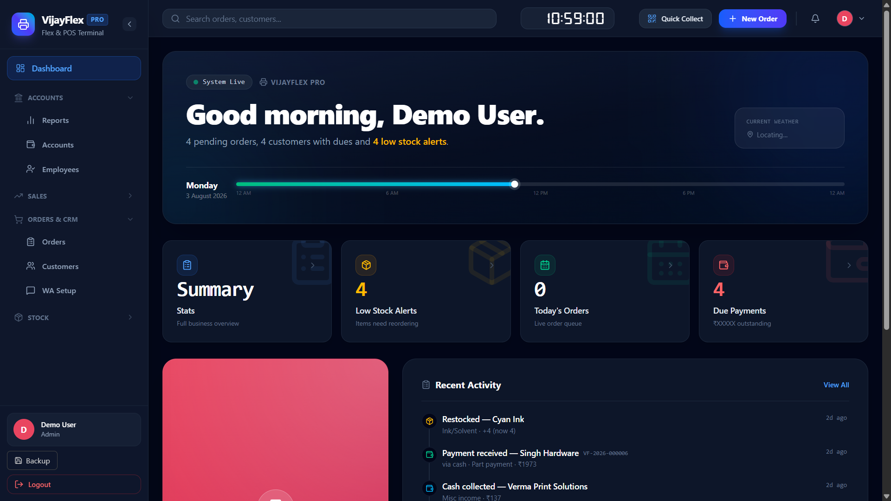

# VijayFlex Pro 🖨️

A full-stack business management system built for a real flex printing shop in Pilibangan, Rajasthan. This project replaces 4 physical registers with a complete digital system — currently in daily production use.

---

## 🚀 Live Demo

> **Status:** In active production use at Vijay Flex, Pilibangan, Rajasthan
>
> This is not a demo project. Real orders, real customers, real payments are managed through this system daily.

---

## 📌 Problem Statement

A flex printing shop manages:
- Customer orders with custom sizes and pricing
- Advance payments, partial payments, and dues
- Daily cash flow across cash, UPI, and cheque
- Employee attendance and salary calculation
- Vendor accounts and purchases
- Inventory of flex rolls, chemicals, ink, stamps, and frames

Previously, all of this was tracked across **4 physical registers** — prone to errors, hard to search, and impossible to audit.

**VijayFlex Pro** digitalizes the entire operation into one system.

---

## ✨ Features

### 📦 Order Management
- Create orders with multiple line items
- L×B size calculator (auto-computes sq.ft from length × breadth)
- Advance payment recording with Cash / UPI mode selection
- Follow-up date tracking with overdue alerts
- Order status pipeline: Pending → In Progress → Ready → Delivered
- Edit orders with automatic financial entry updates
- Soft delete with 24-hour recovery (Recycle Bin)
- **Image uploads** — attach multiple photos to any order (progress photos, design references, delivery proof)

### 👥 Customer Management
- Customer ledger with complete payment history
- Dues tracking across all payment types (advance, order payments, UPI, cheques)
- Payment breakdown by type (Advance / Order Payment / UPI / Cheque)
- Overdue alert banner on customer profile
- Search and filter by firm name or contact
- **Customer photo upload** — profile photo stored per customer

### 💰 Accounts & Payments
- **Cheque Register** — track received/deposited/cleared/bounced cheques with status management
- **UPI Accounts** — 4 UPI accounts (BOI, Google Pay, PhonePe, Amazon Pay) with transaction history and monthly summaries
- **Vendor Accounts** — purchase tracking, payment recording, balance due per vendor
- **Commission Tab** — dedicated tab showing all commission entries by month, with payment mode breakdown and monthly totals (Page Locked)
- UPI payments only counted in totals when not marked as expense

### 📊 Daily Sales & Expenses
- Today's summary with real-time breakdown (Order Payments / Cash Income / UPI / Cheques)
- Record other cash payments linked to customers
- Expense recording with categories, payment mode, and employee/vendor linkage
- **Commission as Expense** — add commission directly from the expense form (Category: Commission); automatically appears in Daily Ledger and Cash Drawer as a separate line
- **Cash Drawer** — opening balance, cash in, cash out, closing balance per day
- **Denomination Counter** — count cash by note denomination (₹500, ₹200, ₹100, ₹50, ₹20, ₹10) with auto-total; useful for end-of-day cash verification
- **Daily Ledger** — income vs expenses split view for any date, with commission shown separately

### 👤 Employee Management
- Attendance marking (Present / Absent / Half Day)
- Color-coded monthly attendance calendar
- Salary calculator (monthly salary ÷ 30 × days present + 0.5 × half days)
- Employee profile with complete payment history (advances + salary credits)
- Employee advances automatically reflected in employee profile

### 📈 Reports
- **Monthly P&L** — income breakdown, expense by category with progress bars, dues list
- **Yearly Summary** — month-wise income/expense/profit table
- **All Dues** — complete outstanding dues across all customers with follow-up dates
- Ghar Khata exclusion from business reports
- Page Locked (admin only)

### 📦 Inventory Management
- **Flex Rolls** — matrix view by brand × size, use modal, low stock warnings
- **Stamps** — quantity tracking with +1/-1 controls
- **Chemicals** — box unit support with items-per-box calculation
- **Photo Frames** — size and design tracking
- **Ink & Solvent** — color cards for ink, table for solvent, minimum level alerts
- **Dynamic Categories** — create any new inventory category from UI (e.g. SunBoard, Vinyl, Lamination) without touching code; each category supports 2 custom attributes
- Page Locked (admin only)

### 📲 UPI QR Generator
- Select from 4 pre-configured UPI accounts
- Enter fixed amount — customer **cannot edit** the amount when scanning
- Generates UPI deep-link QR code instantly (works with all 60+ UPI apps)
- Download QR as PNG for sharing or printing
- **Payment History** — every QR generated is logged with date, UPI account, amount, and remarks
- Mark payments as Received; today's totals shown on summary cards

### 🔐 Page Lock
- Sensitive pages (Accounts, Reports, Inventory, Commission) are PIN protected
- Prevents unauthorized access on shared devices
- PIN can be set per page

### 🗑️ Recycle Bin
- Soft-deleted customers and orders recoverable within 24 hours
- Automatic cleanup after 24 hours

### 📄 PDF Bill Generation
- Professional bill PDF with shop header, customer details, line items, payment history
- Balance due highlighted in red/green
- One-click download from Orders page

### 📱 WhatsApp Integration
- Send PDF bill directly to customer's WhatsApp
- QR code setup page for one-time authentication
- Session persistence (scan once, stays connected)
- Auto-reconnect on disconnect

---

## 🛠️ Tech Stack

| Layer | Technology | Reason |
|-------|-----------|--------|
| Frontend | React 18 + Vite | Fast development, component-based UI |
| Backend | Node.js + Express | Simple REST API, good ecosystem |
| Database | SQLite (better-sqlite3) | Zero config, single file backup, LAN deployment |
| PDF | PDFKit | Server-side PDF generation |
| WhatsApp | whatsapp-web.js | Free, no API cost, personal use |
| QR Code | qrcode (npm) | Client-side UPI QR generation |
| Styling | Inline CSS (React) | No build complexity, full control |

---

## 🏗️ Architecture

```
vijayflex-pro/
├── client/                  # React + Vite frontend
│   └── src/
│       ├── pages/           # 13 page components
│       │   ├── Dashboard.jsx
│       │   ├── Orders.jsx
│       │   ├── Customers.jsx
│       │   ├── CustomerProfile.jsx
│       │   ├── DailySales.jsx
│       │   ├── Employees.jsx
│       │   ├── Accounts.jsx
│       │   ├── Inventory.jsx
│       │   ├── Reports.jsx
│       │   ├── RecycleBin.jsx
│       │   ├── WhatsAppSetup.jsx
│       │   └── UpiQR.jsx
│       ├── components/
│       │   ├── Navbar.jsx
│       │   ├── PageLock.jsx          # PIN protection wrapper
│       │   └── DenominationCounter.jsx
│       └── services/
│           └── api.js               # Axios API calls
│
└── server/                  # Node.js + Express backend
    ├── routes/              # 12 route files
    │   ├── orders.js        # Order CRUD + advance payment + image upload
    │   ├── customers.js     # Customer CRUD + photo upload + profile
    │   ├── payments.js      # Payment recording + balance update
    │   ├── employees.js     # Attendance + salary + profile
    │   ├── daily.js         # Daily sales, ledger, cash drawer, reports
    │   ├── expenses.js      # Expense recording + commission category
    │   ├── accounts.js      # Cheques + UPI + commission tab
    │   ├── vendors.js       # Vendor accounts + purchases
    │   ├── inventory.js     # All inventory + dynamic categories
    │   ├── pdf.js           # PDF bill generation
    │   └── whatsapp.js      # WhatsApp send routes
    ├── db/
    │   └── database.js      # SQLite schema (17+ tables)
    └── whatsapp.js          # WhatsApp client singleton
```

---

## 🗄️ Database Schema

**17+ tables** covering the complete business domain:

| Table | Purpose |
|-------|---------|
| customers | Customer profiles with contact info and photo path |
| orders | Orders with advance payment tracking |
| order_items | Line items per order |
| order_images | Images attached to orders |
| payments | Follow-up payments against orders |
| employees | Employee profiles and salary info |
| attendance | Daily attendance records |
| employee_salary_credits | Generated salary records |
| daily_records | Daily sales and expense totals |
| cash_income | Cash received not linked to orders |
| expenses | All expense records (includes Commission category) |
| cheques | Cheque register with status tracking |
| upi_transactions | UPI payment records |
| vendors | Vendor profiles and balances |
| vendor_transactions | Vendor purchase and payment history |
| inventory_flex | Flex roll stock by brand and size |
| inventory_stamps / chemicals / frames / ink_stock | Other inventory tables |
| inventory_categories | User-created dynamic inventory categories |
| inventory_dynamic_items | Items under dynamic categories |

---

## 💡 Key Technical Decisions

### Why SQLite over MySQL?
LAN-only deployment, zero configuration, single-file backup. The shop has no internet dependency and a single database file can be backed up with one copy operation.

### Why whatsapp-web.js over Meta Business API?
Zero cost for a family business with low message volume. The official API charges per message and requires business verification. whatsapp-web.js uses the existing personal WhatsApp account.

### Why soft delete with 24-hour recovery?
Accidental deletions in a real business have real consequences. A hard delete with no recovery would destroy trust. The 24-hour window is enough time to catch mistakes without permanently cluttering the database.

### Why LAN deployment over cloud?
The shop has intermittent internet. A cloud deployment would make the system unavailable during internet outages. LAN deployment means the system always works regardless of internet.

### Why client-side QR generation for UPI?
UPI QR codes are just encoded strings — no server round-trip needed. Generating on the client means instant QR display with zero latency and no server load.

### Single source of truth for payments
Every payment (cash advance, UPI advance, follow-up payment) is recorded exactly once and linked by foreign key. The customer profile, daily ledger, cash drawer, and reports all read from the same tables — no duplication, no double-counting.

### Commission as a special expense category
Commission is recorded through the standard expense form (Category: Commission) so it flows automatically into the daily ledger, cash drawer, and P&L — no separate data entry path needed. The Accounts page Commission tab then filters this category for a dedicated view.

---

## 🚀 Getting Started

### Prerequisites
- Node.js 18+
- npm

### Installation

```bash
# Clone the repository
git clone https://github.com/dkmahar83/flex-shop-manager.git
cd flex-shop-manager

# Install server dependencies
cd server
npm install

# Install client dependencies
cd ../client
npm install
```

### Running the Application

```bash
# Start backend (from server/)
npx nodemon index.js

# Start frontend (from client/)
npm run dev
```

- Backend: `http://localhost:5000`
- Frontend: `http://localhost:5173`

### WhatsApp Setup
1. Start the server
2. Open `http://localhost:5173/whatsapp`
3. Scan the QR code with WhatsApp on your phone
4. Session is saved — you only need to scan once

---

## 📸 Screenshots

> Add screenshots to a `/screenshots` folder in the repo root, then they will display here automatically.

```
screenshots/
├── dashboard.png          # Live stats, due reminders, today's orders
├── orders.png             # New order with L×B calculator
├── customer-profile.png   # Complete ledger with all payment types
├── daily-ledger.png       # Income vs expenses split by date
├── reports.png            # Monthly P&L with expense breakdown
├── inventory.png          # Flex roll matrix, dynamic categories
├── accounts.png           # Cheque register, UPI accounts, commission tab
├── upi-qr.png             # UPI QR generator with history
├── whatsapp.png           # QR setup and bill sending
└── denomination.png       # Cash denomination counter
```

**How to add:** Take a screenshot of each page → save in `/screenshots/` folder → push to GitHub. They will appear in the README automatically once added as:

```md

```

---

## 🎯 Business Impact

Before VijayFlex Pro:
- ❌ 4 physical registers maintained manually
- ❌ No way to quickly check a customer's dues
- ❌ Salary calculations done manually each month
- ❌ No daily profit/loss visibility
- ❌ Inventory tracked on paper
- ❌ Bills written by hand and shared as photos

After VijayFlex Pro:
- ✅ All data searchable instantly
- ✅ Customer dues visible in one click
- ✅ Salary auto-calculated from attendance
- ✅ Daily P&L visible at end of each day
- ✅ Low stock alerts for all inventory items
- ✅ PDF bills sent directly on WhatsApp
- ✅ Commission tracked separately from regular expenses
- ✅ UPI QR with fixed amount — no payment editing by customer
- ✅ Denomination counter for end-of-day cash verification
- ✅ New inventory categories added from UI — no code changes needed

---

## 👨‍💻 Developer

**Deepak Mahar**
- Student, B.Tech CSE — BIT Mesra (5th Semester)
- Built this project to solve a real business problem for the family flex printing shop
- GitHub: [@dkmahar83](https://github.com/dkmahar83)

---

## 📄 License

This project is built for personal and educational use.

---

> *"One wrong due amount destroys trust."*
> — The guiding principle behind every financial calculation in this system.
